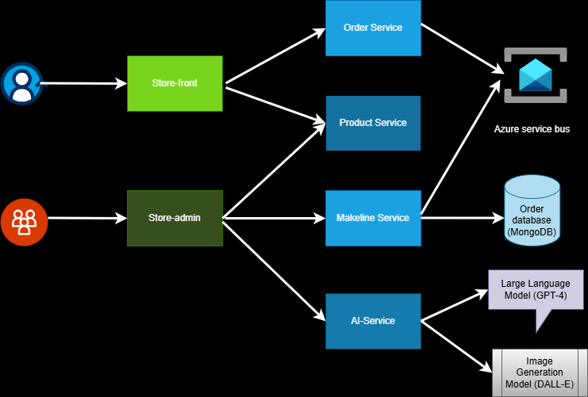
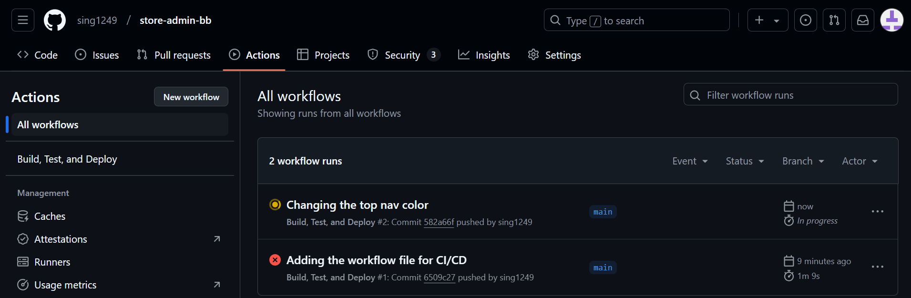
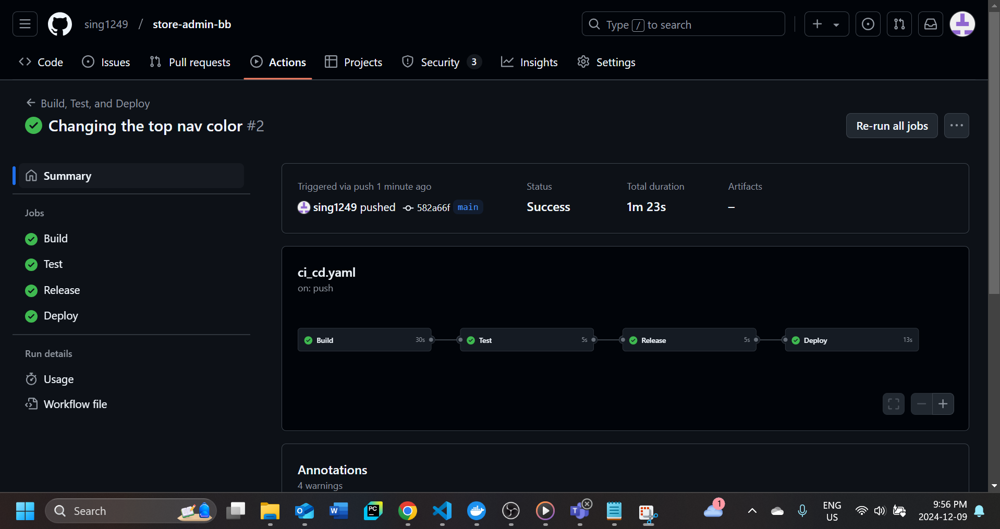
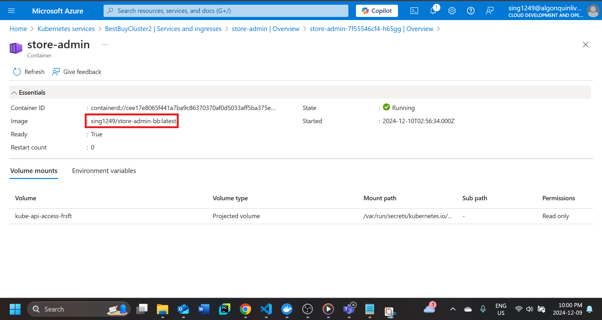
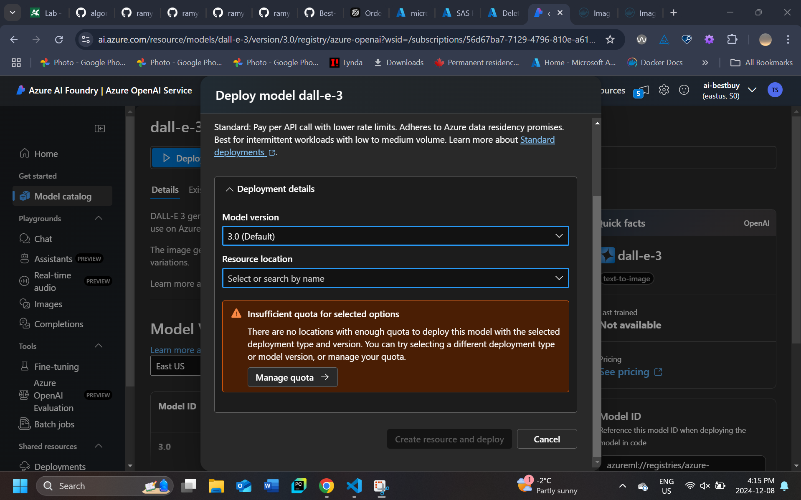

# Project - Building a Cloud-Native App for Best Buy

## Application Architecture
The following diagram shown represents the architecture of the app and how the services are connected to each other. 

## Application and Architecture Explanation:
The architecture represents the receivibg orders and completing the orders for Best Buy. In the diagram, store-front is used by employees to add orders in cart and then they are sent to order-service which is then connected to a managed backend service which is Azure Service Bus.
The store-front fetches orders from product-service which acts as a database for all products Best Buy sells.
Store-admin which is a service used by the company to manage products and manage/complete orders is also connected to product-service. If there is a new product that needs to be added it can be done using store-admin. The store-admin is connected to makeline service which is responsible for sending all completed orders that get completed using store-admin service and storing them into Order Database hosted on managed service (Mongo DB)
AI-service is used to help create description of new products and images for the products. Store-admin has an integrated section to add products and if we add products we can add description by using keywords and generate images for products as well. Ai-service uses two AI models, Dall-e-3 and gpt-4 which are hosted using Azure Open AI service. 

## Deployment Instructions:
In order to deploy the above structure, we will be using Azure Kubernetes Service (AKS). A single yaml deployment file that can be found in Deployment Files folder in this repository will be used. It is named as bestbuy-all-in-one.yaml. 
Steps for deployment:
1. Instead of using the Azure Service Bus, we will be using RabbitMQ.
2. First we will set up the AI services and AKS cluster in Azure Portal.
3. A resource group Project2 was created in Azure Portal, and then we configured in AKS cluster in it.
4. The cluster had 1 systemnodes and 2 workernodes. We configured manual scaling for them.
5. Then Open AI resource was created in the same resource group. After the resource was created, we went into to deploy 2 deployments in this resource. One deployment will be gpt-4 and then other one would be dall-e-3. These services will be used to generate description and images for new products that can be added to Best Buy app.
6. After the deployment of AI deployments, then the Endpoint was added under the env section of the AI service in the bestbuy-all-in-one.yaml file which in available in Deployment Files folder.
7. The key was copied and then base encoded 64 using echo -n "key" | base64.
8. The encoded value was added to the secrets.yaml file.
9. After this was done, we are now ready to connect to the cluster. It was connected by using the commands given in the connect section in Azure Portal under the cluster we just created.
10. After successful connection, switch the working directory to Deployment Files, if not done already, and then we then ran the command to deploy config maps and secrets in the cluster.
    - kubectl apply -f config-maps.yaml
    - kubectl apply -f secrets.yaml
11. After running this command, we will then deploy the services to the clutser using:
    - kubectl apply -f bestbuy-all-in-one.yaml
12. This will then deploy all the applications in pods. In order to access the store front and store admin, they are exposed using Load Balancer. We can go into services Ingression and then access them by clicking on the IP addresses present there for these services.

- To deploy all services together bestbuy-all-in-one.yaml file is used which can be found in Deployment Files folder of this repository.
- Each service can deployed individually as well using kubectl -f apply <<service specific yaml file>> which are also present in the same folder.  

## Table of Microservice Repositories:

| Service Name       | Github Repository Link                                           |
|--------------------|------------------------------------------------------------------|
| **Order Service**   | https://github.com/sing1249/order-service-bb.git|
| **Product Service** | https://github.com/sing1249/product-service-bb.git|
| **Makeline Service**| https://github.com/sing1249/makeline-bb.git |
| **Store Admin**     | https://github.com/sing1249/store-admin-bb.git |
| **AI Service**      | https://github.com/sing1249/ai-service-bb.git |
| **Store Front**     | https://github.com/sing1249/store-front-bb.git|
| **RabbitMQ**        | https://github.com/sing1249/rabbitmq.git |
| **MongoDB**         | https://github.com/sing1249/mongo.git |

## Table of Docker Images:

| Service Name       | Docker Image Link                                           |
|--------------------|------------------------------------------------------------------|
| **Order Service**   | [sing1249/order-service](https://hub.docker.com/repository/docker/sing1249/store-front/tags) |
| **Product Service** | [sing1249/product-service](https://hub.docker.com/repository/docker/sing1249/product-service/tags) |
| **Makeline Service**| [sing1249/makeline-service](https://hub.docker.com/repository/docker/sing1249/makeline-service/tags) |
| **Store Admin**     | [sing1249/store-admin](https://hub.docker.com/repository/docker/sing1249/store-admin/tags) |
| **AI Service**      | [sing1249/ai-service](https://hub.docker.com/repository/docker/sing1249/ai-service/tags) |
| **Store Front**     | [sing1249/store-front](https://hub.docker.com/repository/docker/sing1249/store-front/tags) |

## Youtube video link
https://youtu.be/UQa1D2H8C0E 

## Bonus Task: Implement a CI/CD Pipeline for Each Microservice 
The pipeline will push a new docker image and deploy a new container using that new image. This will take place without the service being down. 
In order to implement a CI/CD pipeline, we will first add our secrets and variables in each repostiories. 
The secrest will be added in Github for each repository.
In order to add them we will follow these steps:
1. We will go to settings for each repository
2. And then go to Secrets and Variable and then Action
3. Under the secrets we will add these 3 secrets:
- DOCKER_USERNAME - This represents my docker username
- DOCKER_PASSWORD - This represents my docker password
- KUBE_CONFIG_DATA - This is obtained by using the following commands. In my case I used these commands. 
"kubectl config view --minify --flatten --output yaml > kube_config_minimal.yaml"
"cat kube_config_minimal.yaml | base64 -w 0 > kube_config_base64.txt"
4. Under variables, we will add 3 variables:
- CONTAINER_NAME - Any container name we want to give, for example store-admin
- DEPLOYMENT_NAME - Name of the deployment we want to give, for example store-admin
- DOCKER_IMAGE_NAME - This will be the new name of docker image that will be created after a new push is pushed to github.

### Screenshots showing the implementation:

## Issues or limitations in the implementation:
I was not able to connect the services using Azure service bus, for this I have tried changing the docker files to include env variables for Azure Service bus, modified the env variables in order-service and makeline-service and ensured they get the base64 encoded secret for Azure Service Bus from secrets.yaml but the solution did not work.
So I have finished the project using RabbitMQ instead. 

### Quota for Dall-e-3
When I was initially doing the deployment, my pod kept crashing for AI-Service and it was showing "CrashLoopBackOff" error in AKS. After research, I figured the image might not be built properly or maybe the Open AI resource was not properly deployed. After rebuilding the image, when I went into deploying the dall-e-3 version again, it showed me that I had insufficient quota. 

In order to overcome this, I tried creating the Open AI resource under my student subscription, and also tried creating AKS cluster under student subscription but the AKS cluster did not work properly as we can not choose 2 workernodes in it. 
So I tried deploying the AKS cluster and open AI in 2 different subscriptions. When I was generating the image and description for new product it did not work.
To overcome this I used kubectl logs "pod name" which showed me that there was an authorization problem. 

The Open AI resource was then deployed in the CDO subscription but since I had insufficient quota I could not deploy dall-e-3 and could only do dall-e-2 but when I chose dall-e-2 gpt-4 could not be deployed as they were available in different region so I chose dall-e-2 and gpt-40 and then that worked for me. 

### Kube Config Data Length:
When I was obtaiting the kube config data and putting it in Github, the length was too long. After some research I found it was showing the data for all the clusters. So in order to get the data for current cluster I used the following commands:
"kubectl config view --minify --flatten --output yaml > kube_config_minimal.yaml"
"cat kube_config_minimal.yaml | base64 -w 0 > kube_config_base64.txt"

### Bonus: Deployment fail for some services
I deleted the AKS cluster after 1-2 services to avoid any charges, because I had to do multiple attempts in making AKS, I wanted to minimize the cost as much as I could that is why some services might show deployment failed.
